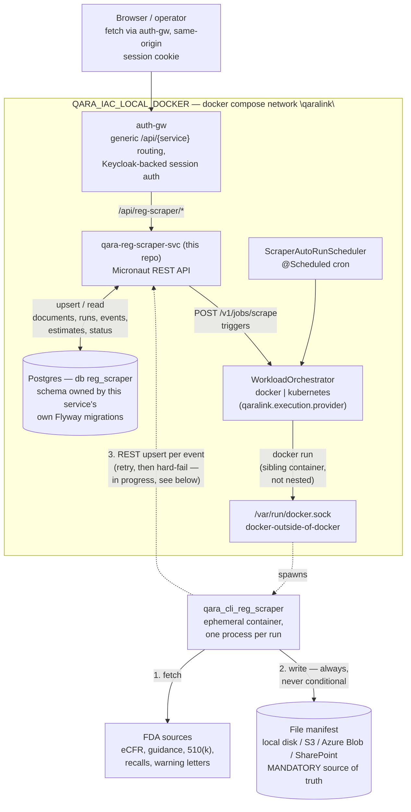

# qara-reg-scraper-svc

⠀This project is a **Micronaut-based backend service** that owns the
Postgres index `qara_cli_reg_scraper` scrapes into, and triggers scrape
runs — on demand via REST, and on a schedule — by launching the
`qara_cli_reg_scraper` Docker image, either as a plain `docker run` or as a
Kubernetes `batch/v1 Job`. It uses Flyway for database migrations, Gradle
and Make for builds, and Docker for local development.

  It is deployed as part of the QARAlink platform (`QARA_IAC_LOCAL_DOCKER`
  locally). The CLI reports what it scrapes to this service instead of
  writing to Postgres directly; operators (or `auth-gw`-fronted browser
  calls) trigger and monitor scrape jobs through this service's REST API.

Built fresh (Micronaut 4.7, Gradle Kotlin DSL, Java 21), following
[`OPC_SVC_DOC`](../OPC_SVC_DOC)'s controller/Flyway/project shape — this
README mirrors that project's own, with a Design section added — with
Docker/Kubernetes job execution ported and adapted from
[`opc_svc_ai`](../opc_svc_ai)'s workload orchestration.

---

## 🚀 Tech Stack

- **[Micronaut](https://micronaut.io/)** – Lightweight, modular Java framework
- **Flyway** – Declarative database migrations (this service is the sole
  owner of the schema `qara_cli_reg_scraper` used to manage itself)
- **PostgreSQL** – Primary database (via Docker)
- **NATS** – Not used for anything yet (see Known limitations) but a hard
  startup dependency via `qara_lib_mn`
- **`io.kubernetes:client-java`** / **Apache Commons Exec** – Job
  execution: a real `batch/v1 Job` (Kubernetes) or a sibling `docker run`
  (Docker, via a mounted `/var/run/docker.sock`)
- **Docker & Docker Compose** – Local development and platform deployment
- **Gradle (Kotlin DSL)** – Build system
- **Make** – CLI shortcut for development tasks

---

## 🎨 Design



Two independent processes, two independent stores, by design:

- **The CLI's file manifest is the only mandatory source of truth.** It's
  written first, unconditionally, before anything else is attempted — a
  scrape is never lost just because this service or Postgres is briefly
  unreachable. `qara-reg-scraper reindex`/`summary` can always rebuild
  everything else from it.
- **This service owns Postgres** — schema via Flyway (not the CLI), a REST
  API to read it, and the only thing that launches scrape work (manually,
  or on `ScraperAutoRunScheduler`'s cron), as a sibling Docker container or
  a Kubernetes `batch/v1 Job`, never in-process.
- **The CLI pushes to this service's REST API as it scrapes**, once per
  manifest write (never a bulk re-walk — `POST /v1/events` is insert-only,
  so re-walking history on every run would duplicate rows). This is the
  piece **in progress as of this session** — see Known limitations below
  for exactly what's landed vs. still pending.

### REST API (`controller/v1/`)

- `POST /v1/documents`, `POST /v1/runs`, `POST /v1/events`,
  `PUT /v1/source-estimates/{regulation}/{source}` — upserts.
- `GET /v1/documents`, `GET /v1/runs`, `GET /v1/runs/latest`,
  `GET /v1/source-estimates/{regulation}/{source}`,
  `GET /v1/status?source=fda:ecfr,fda:recalls` — reads, the last one an
  aggregated per-source row (documents count + latest run + latest
  estimate), the same shape as the CLI's own `status`/`summary` commands.
- `POST /v1/jobs/scrape`, `GET /v1/jobs/{jobId}`, `GET /v1/jobs`,
  `GET /v1/jobs/{jobId}/history` — trigger and track scrape jobs.
- `GET /v1/sources` (optionally `?regulation=fda`), `PUT /v1/sources` — see
  "Source registry sync" below.
- `GET /v1/retry-state` (optionally `?regulation=fda`) — automatic-retry
  policy + per-source circuit-breaker state, see "Automatic retry &
  circuit breaker" below.

### Job execution (`svc/workload/`)

A provider-agnostic `Workload` + `WorkloadOrchestrator`, with `docker`/`k8s`
implementations selected by `qaralink.execution.provider`. Ported from
`opc_svc_ai`, adapted to drop the `QaraContext`/file-based-parameter
machinery this domain doesn't need (a scrape job is a plain CLI invocation
— `run --source ... --quiet` — not a file-in/file-out AI workload). The
k8s/docker diagnostic utility classes (`KubernetesUtils`, `PodDiagnostics`,
`DockerDiagnostics`, ...) live in `opc_svc_ai` itself, not `qara_lib_mn` —
copied here too, under this service's own package, rather than depended on.

### Scheduler (`scheduler/ScraperAutoRunScheduler.java`)

One `@Scheduled` cron trigger (`qaralink.scheduler.cron`, default daily at
03:00) that submits a job for every source listed in
`qaralink.scheduler.sources`, via the exact same code path as a manual
`POST /v1/jobs/scrape` call.

### Automatic retry & circuit breaker (`scheduler/SourceRetryScheduler.java`)

Entirely independent of the daily cron above — a second `@Scheduled` job
(`qaralink.scheduler.retry-check-cadence-minutes`, default every 1 minute)
that keeps re-triggering every known source indefinitely, at one of two
cadences:

- **Still incomplete** (`SourceEstimateEntity.remaining` absent, null, or
  >0) or its latest job failed: roughly once per
  `qaralink.scheduler.retry-interval-minutes` (default 60) — until it
  either catches up or hits `qaralink.scheduler.retry-max-consecutive-failures`
  (default 5) consecutive failed attempts, at which point it's
  **suspended** (flagged for engineering review via `GET /v1/retry-state`)
  instead of retried forever.
- **Fully caught up** (`remaining == 0`) and the last run succeeded:
  roughly once per `qaralink.scheduler.steady-state-check-interval-minutes`
  (default 1440, i.e. once a day) instead — just often enough to notice a
  newly published document without re-hitting an already-current source
  hourly. The same circuit breaker still applies here: a steady-state
  check that starts failing counts toward the same consecutive-failure
  threshold and can still suspend.

Without this steady-state fallback a source would simply stop being
checked at all once it caught up — the daily `sources` cron above is
opt-in and empty by default, so nothing else re-checks it. Ticking far
more often than sources are actually re-triggered is deliberate — cheap
(only iterates the known-source registry, ~7-20 rows today) and gives
`source_retry_state.next_retry_at` sub-minute precision for a UI's "next
automatic try" display, rather than only ever landing on the hour (or the
day).

- `model/db/SourceRetryStateEntity.java` / `SourceRetryStateRepository` /
  `svc/SourceRetryStateService.java` — the usual entity/repository/service
  split, `(regulation, source)`-natural-keyed (`V4__add_source_retry_state.sql`).
  Unlike `RegulationSourceEntity`/`SourceEstimateEntity` (both pushed by
  the CLI over REST), this table is **owned entirely by the scheduler** —
  nothing else ever writes it.
- `ScrapeJobService#triggerRetry` launches `run --source <name> --max-new-documents -1`
  (always unlimited — the whole point of retrying automatically is
  catching the backlog all the way up, not another budgeted partial run),
  carrying `QARA_REG_SCRAPER_RETRY_BUDGET_MINUTES=<retry-interval-minutes>`
  so the CLI's own in-process backoff (see `qara_cli_reg_scraper`'s
  `docs/retry-and-backlog-catchup.md`) never runs longer than this
  scheduler would wait before trying again anyway. Same `Workload`/
  `ScrapeJobEntity` tracking as a real scrape job — distinguishable in
  `GET /v1/jobs` by its `triggeredBy: "retry-scheduler"`, not a different
  workload type (no separate `qaralink.workloads.*` image config exists
  or is needed — it's the same CLI, same image).
- **A manual `POST /v1/jobs/scrape` clears a suspended source's circuit
  breaker** (`ScrapeJobService#trigger`, gated on `triggeredBy == "manual"`
  specifically — the daily cron's own `"scheduler"` trigger deliberately
  does NOT reset this, since that's routine, not a human having actually
  looked at the problem). Fixing the underlying issue and clicking
  "Update now" is what un-sticks it.
- `Workload.env` (new field, alongside the pre-existing `parameters`/
  `annotations`) carries job-specific extra environment variables —
  `DockerWorkloadOrchestrator#buildContainerEnv` merges it on top of the
  base env map it always sets. The Kubernetes side (`K8SWorkloadOrchestrator#setupEnv`)
  is new code with **no prior precedent and no live verification** —
  this environment only exercises the Docker provider (see "Not
  verified" below) — everything before this fed K8s job env entirely
  from the pod template's static `envFrom: secretRef`.

### Source registry sync (`regulation_source` table)

`GET /v1/sources` used to be backed by a hand-maintained Java list
(`RegulationSourceRegistry.java`) that had to be edited by hand every time
`qara_cli_reg_scraper` gained a source — it drifted. It's now a real table
(`regulation_source`, `V3__add_regulation_source.sql`), kept current
entirely by the CLI itself:

- `RegulationSourceEntity` / `RegulationSourceRepository` /
  `RegulationSourceService` — the usual entity/repository/service split,
  natural-keyed on `(regulation, source)` (same pattern as
  `SourceEstimateEntity`, the closest existing precedent).
  `RegulationSourceService#replaceAll` (backing `PUT /v1/sources`) is a
  **full replace-in-place sync**, not an additive push: every entry in
  the request body is upserted, and any existing row NOT in the body is
  deleted — the CLI always sends its entire known-source registry, never
  a partial list.
- `ScrapeJobService#triggerSourceSync` launches
  `qara-reg-scraper sync-sources` the same way `#trigger` launches a real
  scrape — same `Workload`/orchestrator path, same `ScraperRun` image
  (it's the same CLI, just a different subcommand, so no separate
  `qaralink.workloads.*` image config was needed), tracked in the same
  `scrape_job`/`scrape_job_history` tables. A sync job is distinguishable
  from a real scrape job in `GET /v1/jobs` by its sentinel `sources` value
  (`["__sync_sources__"]`), not a different workload type.
- `SourceRegistrySyncStartupListener` fires `triggerSourceSync` once, on
  service startup — the first `ApplicationEventListener<StartupEvent>` in
  this codebase. Combined with the fact that every real scrape job (manual
  or the daily scheduler above) also re-pushes the full registry as one of
  its own first steps, a source added to the CLI's own registry shows up
  here within one service restart or one scheduled scrape run, whichever
  comes first — no manual edit on this side, ever again.

Full picture (both sides — half of this mechanism lives in
`qara_cli_reg_scraper`) documented in that repo's
`docs/source-registry-sync.md`.

### Access control (`svc/security/`)

Two roles, read from the JWT's `resource_access.<client-id>.roles` claim
(ADR-005's own governing convention — lowercase Keycloak client roles,
never realm roles, never groups): **`admin`** gates the one write endpoint
a human ever calls, **`viewer`** gates everything the Markets regulation
UI reads/displays.

**Why this isn't `@Secured` or `QARA_SVC_CMPL`'s mandatory `requireIdentity`
pattern**: this service, unlike every sibling, is reached by two genuinely
different callers *on the same endpoints* — the browser via auth-gw
(always carries a real, validated JWT) and `qara_cli_reg_scraper` itself,
which calls this service **directly** on the internal docker network
(`QARA_REG_SCRAPER_SERVICE__BASE_URL`), bypassing auth-gw entirely, and
**never carries a JWT at all**. Gating a shared endpoint the way
`OPC_SVC_ACCNT`/`QARA_SVC_CMPL` do — authentication mandatory — would 401
every one of the CLI's own `status`/`reindex`/document-and-run-push
calls. This was an explicit decision, not an oversight: **only the
human-facing surface is gated; the CLI's own direct traffic is
untouched, on purpose.**

- `application-secure.yaml` (new — this service had none before) enables
  JWT bearer/JWKS validation (same Keycloak setup every sibling uses),
  but its `intercept-url-map` permits `/v1/**` at `isAnonymous()` — fully
  open at that coarse layer. **All real enforcement happens in code**,
  not at the URL-pattern layer, for exactly the reason above.
- `SecurityConfiguration`/`RequestIdentity` are near-exact copies of
  `QARA_SVC_CMPL`'s own classes of the same name (manual role extraction,
  not Micronaut's native `@Secured`/`RolesFinder` machinery — there's no
  shared library to pull this from; see qara_lib_mn issue #8, filed to
  track centralizing it eventually, low priority).
- `AccessControl` is the one piece neither sibling needs — an *optional*
  auth variant:
  - `requireRole(request, role)` — no JWT at all → 401 (no legitimate
    anonymous caller for this endpoint). JWT present but lacking the role
    → 403.
  - `requireRoleIfAuthenticated(request, role)` — no JWT at all → allowed
    through, no check (the CLI). JWT present but lacking the role → 403.

**Confirmed live**: a malformed/unsigned/garbage `Authorization: Bearer`
header on a `requireRoleIfAuthenticated` endpoint is *also* let through
untouched — Micronaut's own JWT validation fails to resolve any
`Authentication` from it, so the request looks identical to one with no
header at all from `AccessControl`'s point of view. This is consistent
with the design, not a gap: the actual security boundary for the "viewer"
reads is network reachability (can this caller reach the service at
all?) — role-gating is an *additional* layer that only ever applies once
a real, signature-verified identity is presented. `requireRole` (the
`admin`-gated trigger) is unaffected by this — it rejects the absence of
a valid `Authentication` outright, garbage token or none at all.

| Endpoint | Gate |
|---|---|
| `POST /v1/jobs/scrape` | `requireRole(admin)` — the "Update now" trigger, no legitimate anonymous caller |
| `GET /v1/status`, `GET /v1/sources`, `GET /v1/documents` (+`/{id}`, `/{id}/content`), `GET /v1/jobs` (+`/{jobId}`, `/history`), `GET /v1/events`, `GET /v1/retry-state` | `requireRoleIfAuthenticated(viewer)` — everything the Markets UI reads/displays |
| `POST /v1/documents`, `POST /v1/runs`, `POST /v1/events`, `PUT /v1/source-estimates/{regulation}/{source}`, `PUT /v1/sources`, `GET /v1/runs` (+`/latest`) | **No gate at all** — `qara_cli_reg_scraper`'s own direct push/read traffic, never reached via auth-gw, no JWT ever present |

---

## 🏗️ Development Setup

> **Note:** This project does not currently include a `devcontainer.json`
> setup, matching `OPC_SVC_DOC`'s own.

### Prerequisites

- [Docker Desktop](https://www.docker.com/products/docker-desktop) or
  [OrbStack](https://orbstack.dev/)
- [SDKMAN](https://sdkman.io/install)
- Java 21:
  ```bash
  sdk install java 21.0.2-tem
  sdk use java 21.0.2-tem
  ```
- Gradle 8.1.3 or later:
  ```bash
  sdk install gradle 8.1.3
  sdk use gradle 8.1.3
  ```
- The `docker` CLI on `PATH` if running with `EXECUTION_PROVIDER=docker` —
  this service shells out to it (see
  `svc/workload/docker/DefaultCommandRunner`), it doesn't talk to the
  Docker Engine API directly. `EXECUTION_PROVIDER=kubernetes` (the config
  default) instead needs in-cluster or kubeconfig-based access to a real
  cluster.

---

## 🛠️ Quick Start

Run this from the project root:

```bash
make
```

This will display all available `make` commands to help you:
- Build the shadow jar
- Build the Docker image
- Start the full environment (service + Postgres + NATS) with docker-compose
- Stop and clean up

Example:

```bash
make run              # Starts the service and dependencies with docker-compose
make logs-app         # Follows just this service's logs
make psql             # Opens a psql shell inside the compose Postgres
make clean            # Stops and resets everything
```

`EXECUTION_PROVIDER=docker` (used by `make run`'s compose stack) needs the
`qara-reg-scraper:latest` image built locally first
(`docker build -t qara-reg-scraper:latest` in the `qara_cli_reg_scraper`
repo).

---

## 🐳 Deployment

This service is **packaged as a Docker container**
(`com.qaralink/reg-scraper-svc`, matching the platform's
`com.qaralink/<short-name>-svc` naming convention) and deployed as part of
the QARAlink platform — locally via `QARA_IAC_LOCAL_DOCKER`'s
`compose/docker-compose.yml` (see `make use-local-image` there for
iterating on a local build against the real running platform), and, unlike
the Azure-hosted services alongside it in that compose file, not yet
published to `ghcr.io` or onboarded into any `qara_platform_releases`
manifest — it's new. `auth-gw`'s generic `/api/{service}` routing template
already exposes it with zero extra config, since its `CONTEXT_PATH`
(`/api/reg-scraper`) matches that convention.

---

## 📂 Structure Overview

```
.
├── build.gradle.kts        # Gradle Kotlin build script
├── settings.gradle.kts
├── src/
│   └── main/
│       ├── java/com/qaralink/regscraper/
│       │   ├── controller/v1/    # REST controllers
│       │   ├── svc/              # Services + workload orchestration (docker/k8s)
│       │   ├── model/db/         # JPA entities + repositories
│       │   ├── model/dto/        # Wire-format DTOs
│       │   ├── scheduler/        # ScraperAutoRunScheduler
│       │   └── exceptions/
│       ├── resources/
│       │   ├── application*.yml
│       │   └── migration.postgres/   # Flyway migrations
│       └── docker/         # Dockerfile and docker-compose.yml
├── Makefile                # Simplifies common dev tasks
├── README.md
```

### 📌 Versioning Model

Same scheme as `OPC_SVC_DOC`/the rest of the platform: **Semantic
Versioning (SemVer)** computed from the current Git context during the
build (`versioning.gradle.kts`), injected into the application and
`git.properties`, queryable at `/info` (port 8081).

---

## ⚠️ Known limitations / tech debt

**A hard dependency worth knowing about**: `qara_lib_mn`'s
`com.qaralink.nats.NatsService` is an unconditional, eagerly-initialized
(`@Context`) bean with no `@Requires` gate and a non-nullable
`io.nats.client.Connection` constructor parameter. Any service that
depends on `qara_lib_mn` — for `ApiResponse`, `GlobalExceptionHandler`, the
JPA JSON converters, anything — needs a real, reachable NATS broker just to
start, whether or not it actually publishes or subscribes to anything.
This service doesn't use NATS for anything yet; the dependency and the
`nats:` config block in `application.yml` are there purely because
`qara_lib_mn` requires them. Confirmed by testing: neither removing the
`micronaut-nats` dependency nor setting a (non-existent)
`nats.enabled: false` property avoids this — only a real broker connection
does.

**CLI REST integration is in progress**: this service's schema/upsert/
read/job endpoints are built, deployed, and live-verified. The
`qara_cli_reg_scraper` side — pushing documents/runs/events/estimates to
this service as it scrapes, instead of writing only to its own manifest —
is being implemented (retry a few times, then cancel the run with a clear
error rather than silently reporting nothing; see that repo's
`service_client.py`/`manifest.py`). Until it fully lands, a triggered job
runs for real but the data it produces may stay local to the disposable
job container, not yet visible in this service's own Postgres.

**Not verified**: the Kubernetes execution provider (no cluster available
in this environment), and there's no automated test suite yet beyond
compile-checking — verification so far has been live and manual, against a
real Postgres/NATS/Docker.

**A `SourceSync` job's `sources` field is a sentinel, not a real source
list**: `GET /v1/jobs` shows `["__sync_sources__"]` for a job launched by
`ScrapeJobService#triggerSourceSync` (see "Source registry sync" above) —
that's deliberate (it's not scraping any particular source, just pushing
the registry), not a bug or a malformed real job.

**This local environment's Docker execution provider currently can't
start any workload container** (confirmed live, unrelated to the source
registry sync work above — a plain manual `POST /v1/jobs/scrape` for an
existing source fails identically): `docker: Error response from daemon:
make cli opts(): making volume mountpoint for volume
/app/.reg-scraper-documents: mkdir /app: operation not permitted`. Looks
like a rootless-Docker/Podman socket permission issue specific to this
machine's setup, not this service's code — `GET`/`PUT /v1/sources` and
every other REST endpoint work fine regardless, since job *launching* is
the only thing that touches the Docker socket.

**Known, already-fixed bugs worth remembering**: `ApiResponse.notFound(...)`
only builds the response *body* — it has to be wrapped in
`HttpResponse.status(HttpStatus.NOT_FOUND)` to actually set the HTTP status,
which an early pass on `GET /v1/runs/latest`/`GET /v1/jobs/{jobId}` missed.
`@Valid` on a request DTO needs `@Introspected` on the class to work at all.
Micronaut's `micronaut.property.naming.strategy: KEBAB_CASE` rewrites
literal YAML map keys the same way it rewrites property paths — a
`Map<String,String>` config property is the wrong shape for passing a
workload container an env var with an exact required name; use a typed
`String` field and build the literal key in code instead (see
`DockerWorkloadOrchestratorConfiguration`/`DockerWorkloadOrchestrator`).

---

## 📥 Feedback or Questions?

Feel free to open an issue or pull request if you find a bug or want to
contribute!
